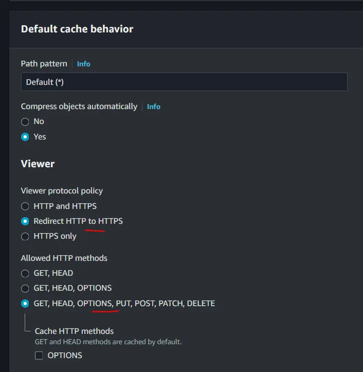
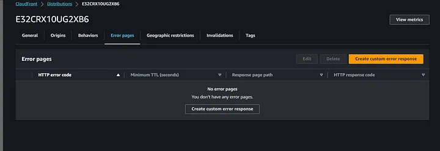
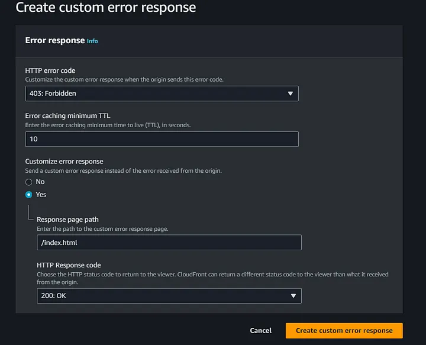
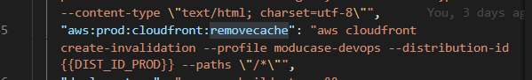

# Cloudfront Deployment Step To Staging

## Create AWS S3 Bucket (Doing Only Once)
1. Go to S3: https://s3.console.aws.amazon.com/s3/home?region=us-east-1#
2. Then create a new bucket called: static-website-frontend-stage-example. We will set ACLs enabled so that other account can use the bucket.
3. Make the bucket public accessible.
4. Select the bucket you created, click "Properties" tab, we need to enable "Static website hosting".
5. [IMPORTANT!] Make sure to enter “index.html” in both index document and error document. Otherwise, you will hit “Access Denied” error, usually breaking React Router if error document no point back to entry page.

## Create AWS Cloudfront Distribution (Doing Only Once)
1. Go to cloudfront: https://us-east-1.console.aws.amazon.com/cloudfront/v4/home?region=us-east-1#/distributions
2. In Origin domain, select the bucket you created just now.
3. At default cache behavior, select "Redirect HTTP to HTTPS" in viewer protocol policy and "GET, HEAD, OPTIONS, PUT, POST, PATCH, DELETE" in Allowed HTTP methods.

4. Leave the rest as default, then create distributions.
5. Then you will see a domain url is created for you which will be used to access the cloudfront. Alternatively, you can make it as CName mapped to route53 if you have a custom domain.

6. [IMPORTANT!] We need to create custom error response. This is the same when we add index.html in error document in S3 static website setting. We need to point 403 error back to 200.

7. [IMPORTANT!] We need to point 403 error page to /index.html with response 200 since we already have our internal error page built inside React app to handle that.

## Update Cloudfront Dist ID in package.json (Doing Only Once)
1. Grab the distribution ID from cloudfront and replace {{DIST_ID_PROD}} with it

## Run deploy script (Doing As Per Needed)
1. [Stage] `npm run deploy:stage`
2. [Prod] `npm run deploy:prod`# moduspace
# moduspace
# moduspace
# moduspace
# moduspace
# moduspace
# moduspace
# moduspace
# moduspace
